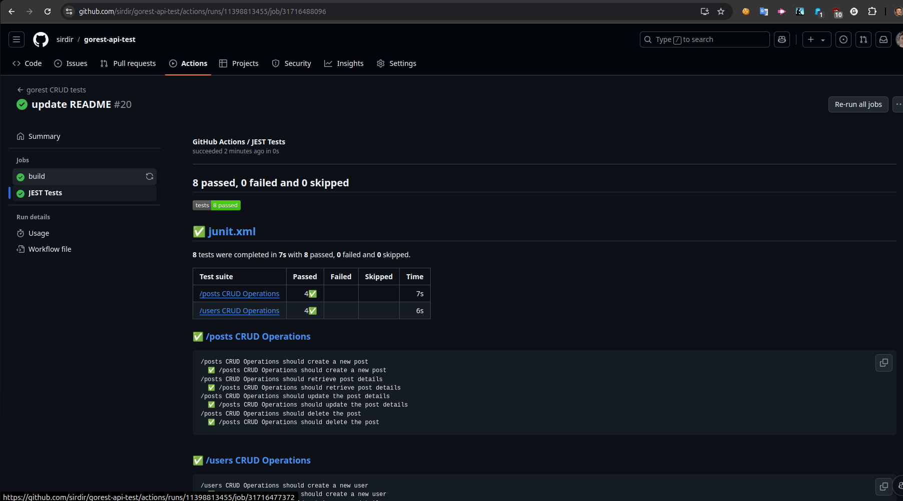
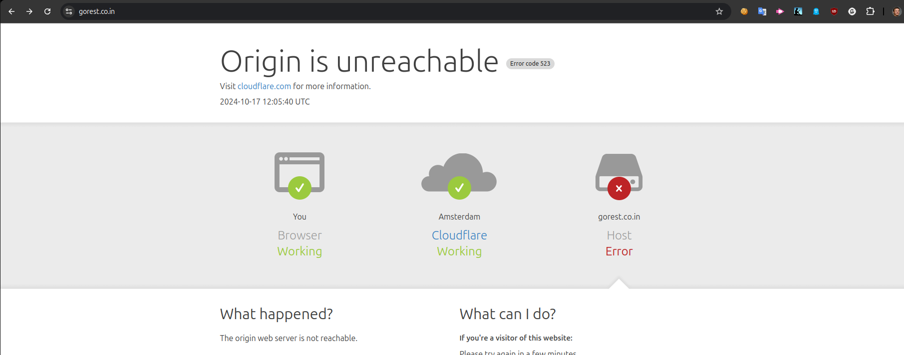

# Gorest CRUD tests

This project contains CRUD tests for `/users` and `/posts` GoRest APIs.

## Prerequisites

- Node.js >= 18
- For local usage, update the Bearer Token inside the `.env` file

## Setup and Run the Project

1. Clone the repo:

```sh
git clone https://github.com/your-username/gorest-api-test.git
cd gorest-api-test
```

2. After repo is clonned, next step is to install all the packages with:

```
npm install
```

3. Replace `TODO` Bearer Token inside `.env` file with valid one

4. And you can run all the the tests with one command:

```
npm run test
```

### GitHub CI

Project is configured to trigger github Action on a new push and pull request to the `main` branch.

As well you can trigger action manually [over here](https://github.com/sirdir/gorest-api-test/actions/workflows/gorest.yml), in this place I assume that you know how to do it, otherwise follow [this instructuions](https://docs.github.com/en/actions/managing-workflow-runs-and-deployments/managing-workflow-runs/manually-running-a-workflow)

### Test Reports
Thre is as well added some basic test reporter that can be found in each run as separate job 

### P.S.

Hi guys, I would like to add some remarks.
Hope you enjoyed reviewing it. Nothing fancy in this repo, tried to be more concise. Haven't used GitHub Actions, so hopefully, if there are better ways to do things, I would like to have feedback. The git history is made as segregated as possible, and you can see the project's evolution through time.

-----

I have experienced this error during testing and it failed couple of builds before I figured out why. Hosting was not available like 12 hours so it delayed me from finishin testing assignment for a day. So tests are not working i have run them multiple times, please check manually https://gorest.co.in/ to verify that domain at least working
